# ng-dough-oreos-app

## Your first Angular app

[See the full tutorial here](https://angular.dev/tutorials/first-app)

### Introduction

#### Node.js

1. `node --version` (for me it was `20.x`)
1. [Install `node.js`](https://nodejs.org/en/download/) (LTS version recommended). (`22.14.0`, as of 2025-04-11)

##### Windows

Open a command shell in "Administrator" mode and run the following commands:

1. `$> choco install nodejs-lts --version="22.14.0"`

##### Verify

1. `node --version` (should be `v22.14.0`)

#### npm

Open a command shell in "Administrator" mode and run the following commands:

1. `$> npm install -g --update npm`
1. `$> npm --version` (`11.3.0` as of 2025-04-11)

#### Angular CLI

1. `$> npm install -g --update @angular/cli`
1. `ng --version` (`19.2.7` as of 2025-04-11)

#### Visual Studio Code

##### Angular Language Service

- [Angular Language Service](https://marketplace.visualstudio.com/items?itemName=Angular.ng-template)

### 01. Hello world

[Hello world](https://angular.dev/tutorials/first-app/01-hello-world)

1. [Download the `.zip`](https://angular.dev/tutorials/first-app/01-hello-world)
1. `$> npm install`
1. `$> ng serve` (start and keeps running)
1. Added `.gitignore`
  - `Node.gitignore`
  - `VisualStudioCode.gitignore`
  - `angular.gitignore`

#### Before

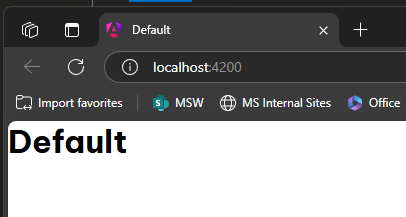

#### Change

1. Replace "Default" with "Hello world"

#### After

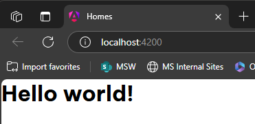

### 02. Create Home component

[Create Home component](https://angular.dev/tutorials/first-app/02-HomeComponent)

1. `$> ng generate component home`
1. `$> ng serve`

#### Before


#### Changes

- Change `app.component` to include `HomeComponent`

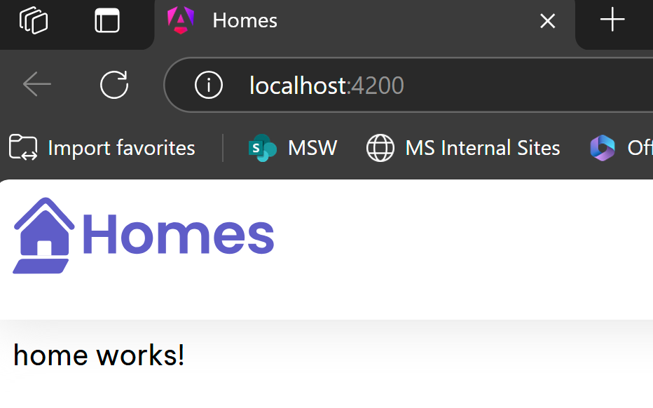

- Change `home/home.component.*`

##### After

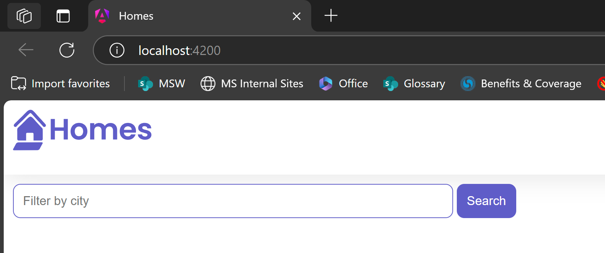

### 03. Create the application’s HousingLocation component

[Create the application’s HousingLocation component](https://angular.dev/tutorials/first-app/03-HousingLocation)

1. `$> ng generate component housingLocation`
1. `$> ng serve` (leave running)
1. Add `housing-location` to `house` `component`.

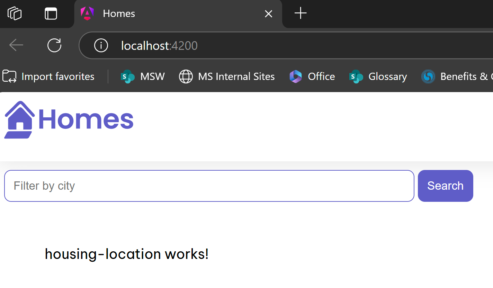

### 04. Creating an interface

[Creating an interface](https://angular.dev/tutorials/first-app/04-interfaces)

#### Interface

1. `$> ng generate interface housinglocation`
1. `$> ng serve` (leave running)
1. Replace contents of `app/housinglocation.ts`

### Dummy "Test House" data

1. Add `housingLocation:HousingLocation` on `HomeComponent` class.

### 05. Add an input parameter to the component

[Add an input parameter to the component](https://angular.dev/tutorials/first-app/05-inputs)

1. Add `@Input()` to `HousingLocationComponent` class.

### 06. Add a property binding to a component’s template

[Add a property binding to a component’s template](https://angular.dev/tutorials/first-app/06-property-binding)

1. Add a property binding to `housing-location` in `home.component.html`

### 07. Add an interpolation to a component’s template

[Add an interpolation to a component’s template](https://angular.dev/tutorials/first-app/07-dynamic-template-values)

1. Add HTML to `housing-location.component.ts`

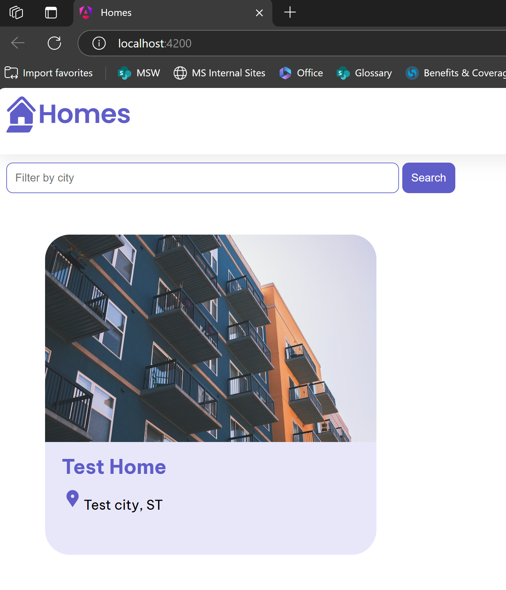

### 08. Use *ngFor to list objects in component

[Use `*ngFor` to list objects in component](https://angular.dev/tutorials/first-app/08-*ngFor)

1. Replace `housingLocation` w/ `housingLocationList` in `home.component.ts`
1. Add `*ngFor` to `housing-location` in `home.component.html`

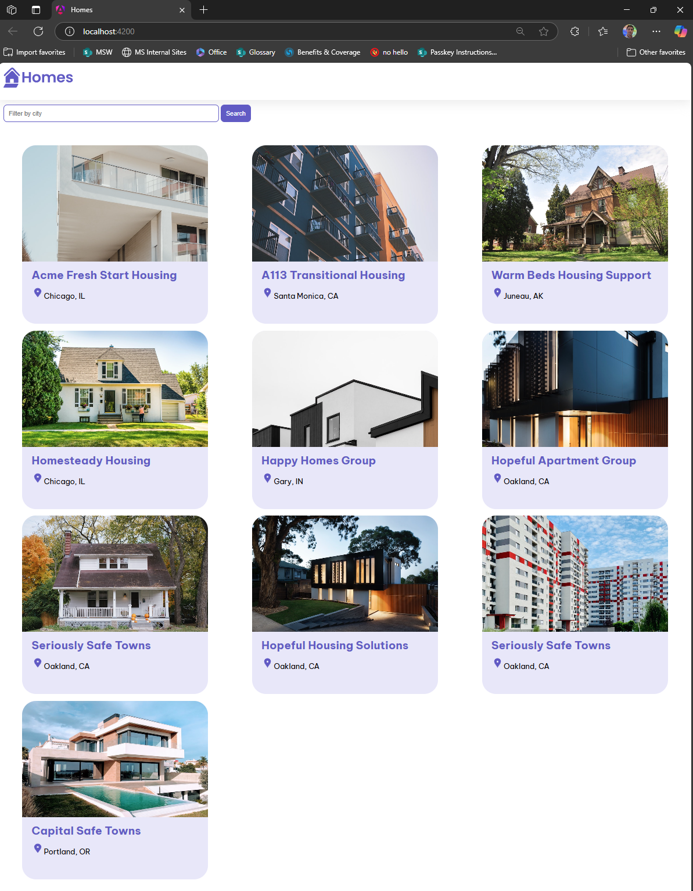

### 09. Angular services

[Angular services](https://angular.dev/tutorials/first-app/09-services)

1. `$> ng generate service housing --skip-tests`
1. Copy `houseLocationList` to `housing.service.ts`
1. `inject` `HousingService` into `HomeComponent` `constructor`

### 10. Add routes to the application

[Add routes to the application](https://angular.dev/tutorials/first-app/10-routing)

#### DetailsComponent

1. `$> ng generate component details`

#### Routing

##### routes.ts

1. Create `src/app/routes.ts` file.

##### src/app.component.ts

1. Replace `HomeComponent` with `RouterModule` in `app.component.ts`
1. Replace `<app-home>` with `<router-outlet>` in `app.component.ts`

##### main.ts

1. Add routing to `bootstrapApplication` in `src/main.ts`

### 11. Integrate details page into application

[Integrate details page into application](https://angular.dev/tutorials/first-app/11-details-page)

#### HousingLocationComponent

1. Add `[routerLink]` to `housing-location` for dynamic navigation.

#### DetailsComponent

1. `inject` `ActivatedRoute` into `DetailsComponent` constructor.

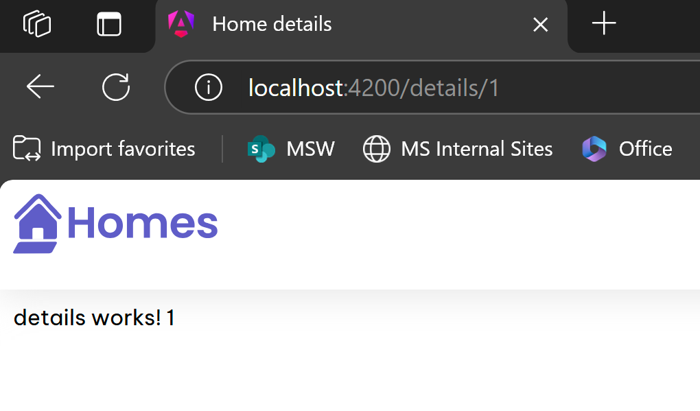

1. Add details to `details.component.ts`

##### House 1

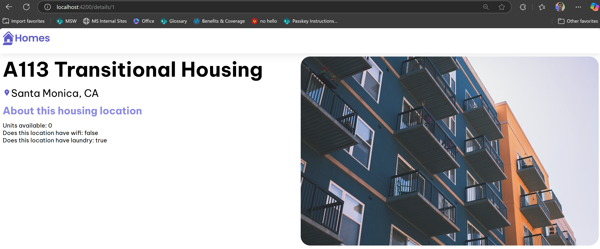

##### House 2


#### AppComponent

1. Add `routerLink` to `app.component.ts`

### 12. Adding a form to your Angular app

[Adding a form to your Angular app](https://angular.dev/tutorials/first-app/12-forms)

#### HousingService

1. Add a `submitApplication` method inside `housing.service.ts`

#### DetailsComponent

1. Add `FormGroup` to `DetailsComponent` class.
1. Add a proxy `submitApplication` method
1. Add a `<section>` with a `<form` tag mapping `firstName`, `lastName` and `email` to the `FormGroup` in `details.component.ts`.

#### Result

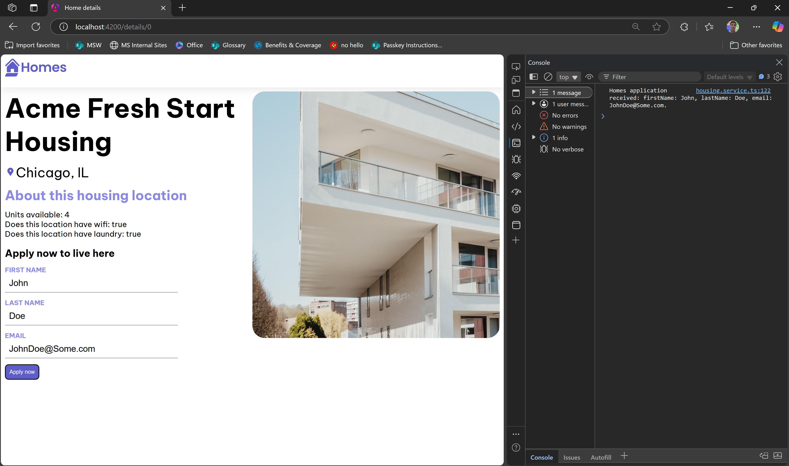

### 13. Add the search feature to your app

[Add the search feature to your app](https://angular.dev/tutorials/first-app/13-search)

1. Move `housingLocationList` behind a `filterResults` method in `home.compnonent.ts`

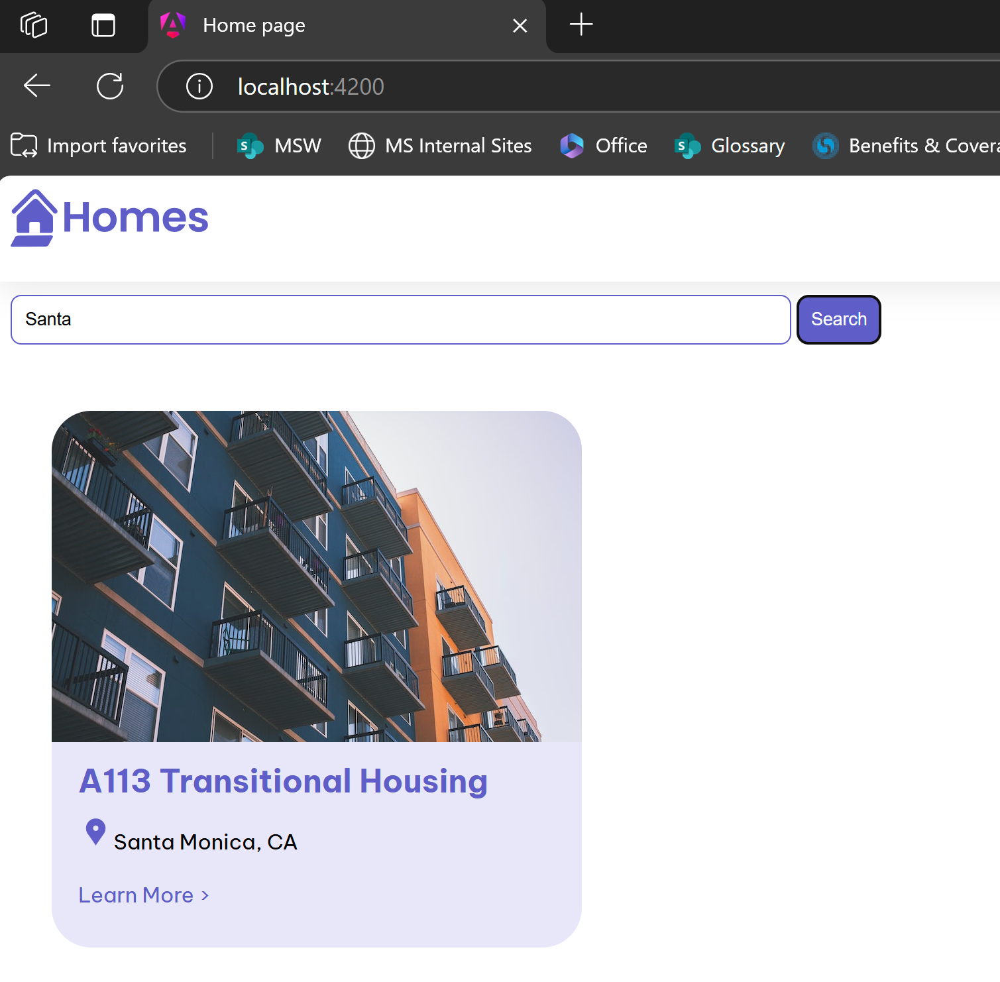

### 14. Add HTTP communication

[Add HTTP communication](https://angular.dev/tutorials/first-app/14-http)

#### JSON Server

This will emulate a REST API for the app.

1. `$> npm install -g json-server`.
1. Copy Houses from `housing.service.ts` to a `db.json` file.
1. `$> json-server --watch db.json` (this will start a server on port `3000`)

#### HousingService

1. Remove `housingLocationList` from `housing.service.ts`
1. Add references to the RESTful API mocked by `json-server`.

## Dockerization

### http-server

1. `$> npm install -g http-server`
1. Added `server.js`

### angular.json

1. Replaced `builder`

```json
  "architect": {
    "build": {
      "builder": "@angular-devkit/build-angular:browser",
```

See [Angular application build system](https://angular.dev/tools/cli/build-system-migration)

### Dockerfile(s)

1. Added multi-target `Dockerfile`s
1. Copied `.gitignore` as `.dockerignore`

### docker-compose.yml

Puts everything together.

## C# Backend

### Scaffolding

1. Created a new C# project using the Visual Studio template for **ASP.NET Core Web API**.

### Clean architecture

Created projects for

- **Domain**: DDD entities and interfaces.
- **Connectors**: Interfaces for the data access layer (i.e. EF).
- **Business**: Business logic and services.

These do NOT need to be separate Projects.
However, this setup prevents circular dependencies.

### Entity framework

Based on these 2 tutorials

- [Getting Started with EF Core](https://learn.microsoft.com/en-us/ef/core/get-started/overview/first-app?tabs=netcore-cli)
- [Tutorial: Get started with EF Core in an ASP.NET MVC web app](https://learn.microsoft.com/en-us/aspnet/core/data/ef-mvc/intro?view=aspnetcore-9.0)

#### Connectors

1. Added `Microsoft.EntityFrameworkCore.*` packages to the `Connectors` project.
1. Added `Entities` (`HousingLocation`)
1. Added `DbContext` (`FirstAppDbContext`)

#### WebApp

1. Added `LocationsController`
1. Removed `Weather` related stuff
